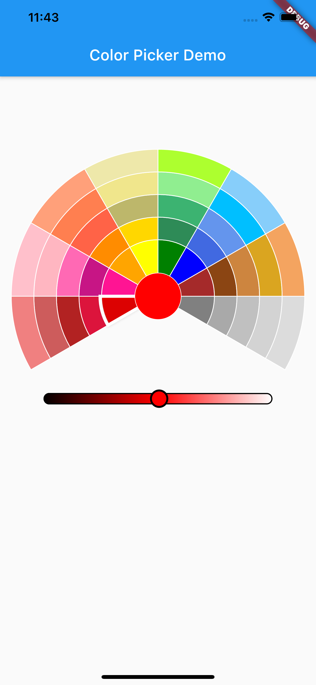

# color_picker_wheel
 A simple color picker to select color from given range of colors and set its shade more darker or lighter

### Screenshots


## Usage

To use this plugin :

* Add the dependency to your [pubspec.yaml] file.

```yaml
  dependencies:
    flutter:
      sdk: flutter
    color_picker_wheel:
```

* In your file add the following import:

```dart
import 'package:color_picker_wheel/color_picker_wheel_widget.dart';
```

### Example

```dart
import 'package:color_picker_wheel/color_picker_wheel_widget.dart';
import 'package:flutter/material.dart';

void main() {
  runApp(MyApp());
}

class MyApp extends StatelessWidget {
  @override
  Widget build(BuildContext context) {
    return MaterialApp(
      title: 'Color Picker Demo',
      theme: ThemeData(
        primarySwatch: Colors.blue,
        visualDensity: VisualDensity.adaptivePlatformDensity,
      ),
      home: Scaffold(
        appBar: AppBar(
          title: Text("Color Picker Demo"),
        ),
        body: SafeArea(
          child: ColorPickerWheel(
            colorListener: (color) {
              print("${color.toString()}");
            },
          ),
        ),
      ),
    );
  }
}

```